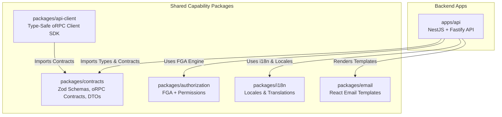
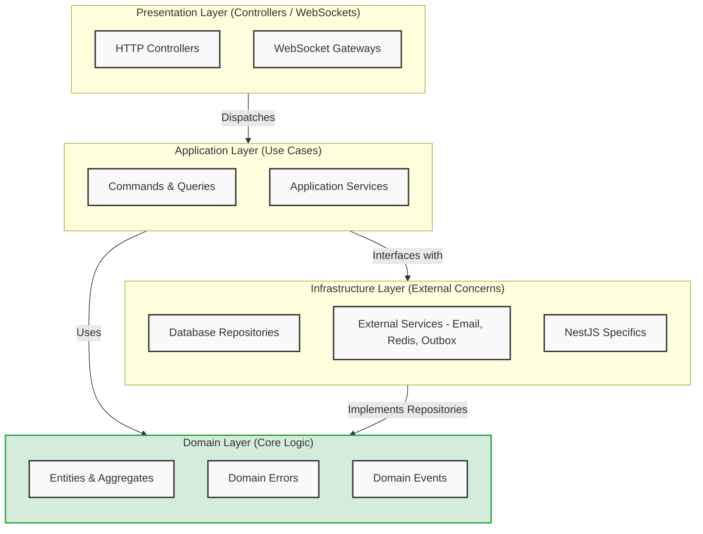
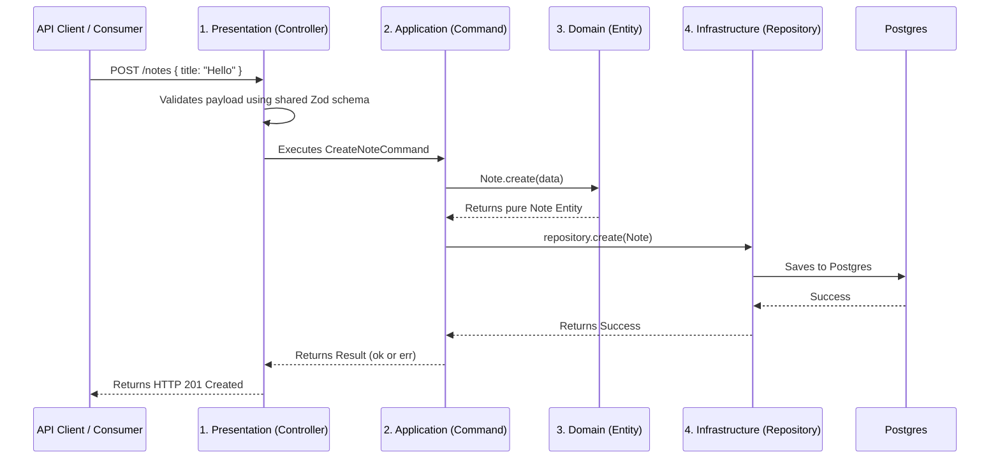

# Architecture Manifesto & Deep Dive

Welcome to the ultimate guide to our codebase. This repository is built upon strict architectural principles designed for massive scale, effortless team collaboration, and extreme maintainability.

Our architecture strictly follows **Modular Monolith**, **Clean Architecture**, **CQRS (Command Query Responsibility Segregation)**, and the **`neverthrow` Result pattern**.

This document will explain **what** we use, **why** we use it, and **how** it all connects perfectly.

---

## 1. The Big Picture (System Map)

Our code is organized as a **Monorepo** using **Turborepo** and **pnpm**. This means all backend applications and shared capability packages live in one single Git repository.

### Why a Monorepo?

By sharing capability packages (`@repo/contracts`, `@repo/authorization`, `@repo/i18n`, `@repo/api-client`, `@repo/email`), any external client or micro-frontend speaks the exact same language. If the backend changes an API rule or contract, the client will show a red compiler error instantly before the code is even run. No more broken APIs!

---

## 2. The Single Source of Truth (`packages/contracts`, `authorization`, `i18n`)

This is the most important layer in the project. It holds all the rules for our data.

- **Zod Schemas (`@repo/contracts`)**: Rules for what data should look like (e.g., `Email must be a string`).
- **oRPC Contracts (`@repo/contracts`)**: The exact blueprints for our API endpoints (`oc.route().input().output()`).
- **Permissions & Evaluator (`@repo/authorization`)**: Action vocabulary (`notes:create`, `team:invite`) and pure FGA engine (RBAC + ReBAC + ABAC).
- **Locales (`@repo/i18n`)**: All the text shown to users (`en.json` containing `"api.user.notFound": "User not found"`), consumed via `I18nService` (backend).

### The Rule

We never write validation logic twice. The backend uses these Zod schemas (via `ZodValidationPipe` + `AllExceptionsFilter`) to validate incoming data. All user-facing text is pulled from `@repo/i18n` to prevent hardcoded strings. All error messages go through `I18nService.t()`.

---

## 3. The Backend Modular Monolith (`apps/api`)

We deploy as a single, easily hosted Node.js process using **NestJS 11** and **Fastify 5**. However, internally, our codebase is split into **strictly isolated Modules** (e.g., `users`, `notes`, `tenancy`, `auth`, `files`).

- `auth` does not know how `users` works inside.
- Modules communicate exclusively through Application-layer Commands/Queries or Domain Events.
- **Never** directly import another module's Infrastructure Repository or Drizzle pgTable.

Every domain module strictly separates our codebase into 4 Clean Architecture layers, enforcing the Dependency Rule (inner layers cannot know about outer layers).

### Module Boundaries

### The Request Flow Map

Here is exactly how a request travels through the 4 layers when creating a resource (e.g., Note):

### Layer 1: Presentation Layer (`presentation/`)

- **What it is:** The front door of the backend. It contains Controllers and Mappers, protected by `@RequirePermission` (FGA), `@Idempotent`, `@Public`/`@TenantAgnostic`, and `ZodValidationPipe` (from `@repo/contracts` schemas).
- **The Rule:** Controllers are thin. They validate HTTP requests (Zod), call exactly one Application command/query, and map `Result<T,E>` to HTTP via `handleResult` + `I18nService`.
- **Why?** Controllers should _never_ make business decisions. If they do, you can't reuse that logic for a queue worker, cron job, or WebSocket gateway.

### Layer 2: Application Layer (`application/`)

- **What it is:** Orchestrates use cases. Interacts with Repositories (never Drizzle schemas). Emits Domain Events or enqueues via `OutboxService`/`BullMQ`.
- **The Rule:** Strict **CQRS**. We do not use monolithic "God Services". Every single use-case in this application is broken down into an isolated class:
  - **Commands:** Mutate state (e.g., `CreateUserCommand`) -> `Result<T,E>`.
  - **Queries:** Read state without mutating (e.g., `GetUserByIdQuery`) -> `Result<T,E>`.
  - **Listeners:** React to events (`welcome-email.listener`, `notes-realtime.listener`) — idempotent, never throw.
- **Why?** Flat services are globally banned. Isolated commands keep files `<150 lines`, testable, and highly specific.

### Layer 3: Domain Layer (`domain/`)

- **What it is:** Pure business logic. Entities, Value Objects, Domain Events, Errors.
- **The Rule:** Zero framework dependencies. No NestJS, no Drizzle, no HTTP. Just pure TypeScript classes and `neverthrow` types.
- **Why?** If you change Postgres tomorrow, your business logic should not change. The Domain Layer ensures your business rules are protected.

### Layer 4: Infrastructure Layer (`infrastructure/`)

- **What it is:** Drizzle `pgTable` schemas, Repositories (`BaseRepository`/`TenantScopedRepository`), Redis/BullMQ, Piscina workers, S3/MinIO, Email (Resend/SMTP via CircuitBreaker), Realtime (WS/SSE), Outbox, Audit, Metrics, Tracing.
- **The Rule:** No business logic allowed. `cross-cutting` infra lives in `src/infrastructure/*` (`@Global()`), `domain-specific` infra lives in `modules/[domain]/infrastructure/*`.
- **Why?** The Application layer asks to save data. The Infrastructure layer knows _how_ to save it to Postgres. Repositories map Drizzle rows back into pristine Domain Entities before handing them back. Tenant isolation is app-enforced via `BaseRepository` + `TenantContextService` (CLS `tenantId`) — `findById/updateById/softDelete/delete` are all tenant-scoped.

---

## 4. Handling Errors Gracefully (Railway Oriented Programming)

We **never** `throw new Error()` for expected domain or application errors (like "Email Taken").
Instead, our Application layer returns a `Result<Value, DomainError>` using the **`neverthrow`** library.

### Why?

Thrown exceptions act like hidden GOTO statements that crash apps unexpectedly. They force you to wrap everything in `try/catch`.

### How it works:

1. The Command returns a `Result` box. It either contains `ok(data)` or `err(error)`.
2. The Controller safely unwraps this Result.
3. If it's an error, it maps the Domain Error to the correct HTTP Status code (e.g., 400 or 404) and translates the error message using `I18nService`.
4. Thrown exceptions are reserved exclusively for actual infrastructure crashes (e.g., Database disconnected).

---

## 5. Developer Checklist

When building a new feature (like "Invoices"), follow this flow:

- [ ] **Contracts:** Define the Zod schema and oRPC contract (`oc.route().input().output()`) in `packages/contracts/src/schemas` + `contracts`.
- [ ] **Domain:** Create an `Invoice` pure TypeScript class in `modules/invoices/domain/entities` (no framework deps).
- [ ] **Infrastructure:** Create a Drizzle `pgTable` in `modules/invoices/infrastructure/schemas` and an `InvoicesRepository extends TenantScopedRepository` in `infrastructure/`.
- [ ] **Application:** Create a specific `CreateInvoiceCommand` in `application/commands/` that returns a `Result<T,E>` and dispatches via `OutboxService` if critical.
- [ ] **Presentation:** Create an `InvoicesController` in `presentation/` that validates via `ZodValidationPipe` (schemas from `@repo/contracts`), calls the command, handles the `Result` via `handleResult` + `I18nService`, and maps to HTTP; protect with `@RequirePermission` + `@Idempotent`.
- [ ] **AuthZ:** Add action vocabulary in `packages/authorization/src/permissions.ts` and policies in `application/invoices.policies.ts`, register via `OnModuleInit`.
- [ ] **Text:** Put all user-facing English text inside `packages/i18n/src/locales/en.json` (and `es.json`/`fr.json`), use `I18nService.t()`.
- [ ] **API Client:** Export the new routes from `packages/api-client`. Generate the slice fast with `pnpm generate:feature invoices invoice`.

---

## Enforcement

The rules defined in `ai_instructions/` are supreme. `pnpm rules:check` runs
dependency-cruiser together with repository convention checks, and CI blocks violations.

Dependency-cruiser enforces that domain code cannot depend on outer layers or NestJS/Drizzle,
controllers cannot import module infrastructure, application code cannot import Drizzle pgTables,
modules cannot import another module's infrastructure or schemas, and dependency cycles fail the build.
Shared contracts and cross-cutting technical services remain intentional, documented exceptions.
