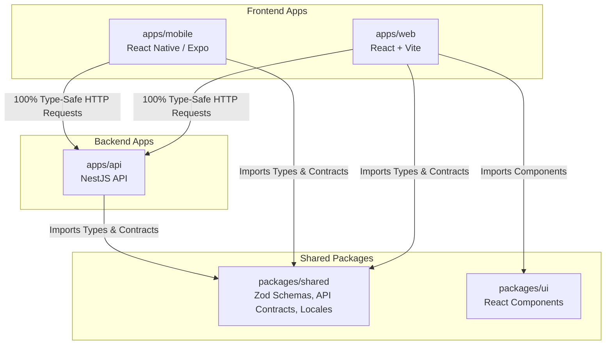
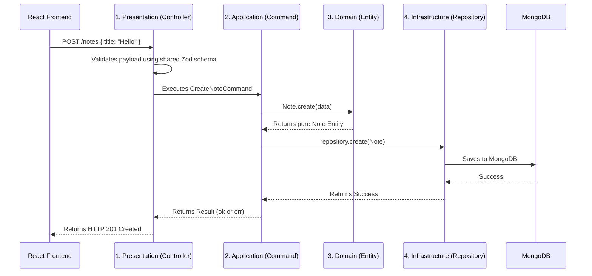

# Architecture Manifesto & Deep Dive

Welcome to the ultimate guide to our codebase. This repository is built upon strict architectural principles designed for massive scale, effortless team collaboration, and extreme maintainability. 

Our architecture strictly follows **Modular Monolith**, **Clean Architecture**, **CQRS (Command Query Responsibility Segregation)**, and the **`neverthrow` Result pattern**.

This document will explain **what** we use, **why** we use it, and **how** it all connects perfectly.

---

## 1. The Big Picture (System Map)

Our code is organized as a **Monorepo** using **Turborepo** and **pnpm**. This means all our apps (frontend, backend) and shared packages live in one single Git repository.

### Why a Monorepo?
By sharing a package called `packages/shared`, the backend and frontend speak the exact same language. If the backend changes an API rule, the frontend will show a red compiler error instantly before the code is even run. No more broken APIs!

---

## 2. The Single Source of Truth (`packages/shared`)

This is the most important folder in the project. It holds all the rules for our data.

- **Zod Schemas**: Rules for what data should look like (e.g., `Email must be a string`).
- **ts-rest Contracts**: The exact blueprints for our API endpoints (e.g., `POST /users requires this body`).
- **Locales (i18n)**: All the text shown to users (e.g., `en.json` containing `"userNotFound": "User not found"`).

### The Rule
We never write validation logic twice. The backend uses these Zod schemas to validate incoming data. The frontend uses the *exact same* Zod schemas to validate forms before submitting. All user-facing text is pulled from the `i18n` locales to prevent hardcoded English strings.

---

## 3. The Frontend (`apps/web` & `apps/mobile`)

- **Web Core**: React 19, Vite, TanStack Router.
- **Mobile Core**: React Native, Expo, Expo Router.
- **State Management**: Zustand (global state) and TanStack Query (server state).
- **UI Components**: Built using `@repo/ui` (shadcn/ui + Tailwind CSS v4).

### How does it work?
We use a generated API client powered by `@ts-rest/react-query`. It reads the contracts from `packages/shared` and knows exactly what the backend expects and returns. We achieve **100% end-to-end type safety**.

---

## 4. The Backend Modular Monolith (`apps/api`)

We deploy as a single, easily hosted Node.js process using **NestJS 11**. However, internally, our codebase is split into **strictly isolated Modules** (e.g., `users`, `notes`).
- `auth` does not know how `users` works inside.
- Modules communicate exclusively through Application-layer Commands/Queries or Domain Events.
- **Never** directly import another module's Infrastructure Repository or Mongoose schema.

Every domain module strictly separates our codebase into 4 Clean Architecture layers, enforcing the Dependency Rule (inner layers cannot know about outer layers).

### The Request Flow Map

Here is exactly how a request travels through the 4 layers when a user tries to create a Note:

### Layer 1: Presentation Layer (`presentation/`)
- **What it is:** The front door of the backend. It contains Controllers and Mappers.
- **The Rule:** Controllers are stupid. They parse HTTP requests, call the Application layer, and map results to HTTP responses. 
- **Why?** Controllers should *never* make business decisions. If they do, you can't reuse that logic for a cron job or message queue.

### Layer 2: Application Layer (`application/`)
- **What it is:** Orchestrates use cases. Interacts with Repositories. Emits Events.
- **The Rule:** Strict **CQRS**. We do not use monolithic "God Services". Every single use-case in this application is broken down into an isolated class:
  - **Commands:** Mutate state (e.g., `CreateUserCommand`).
  - **Queries:** Read state without mutating (e.g., `GetUserByIdQuery`).
- **Why?** Flat services are globally banned. Isolated commands keep files small, testable, and highly specific.

### Layer 3: Domain Layer (`domain/`)
- **What it is:** Pure business logic. Entities, Value Objects, Domain Events.
- **The Rule:** Zero framework dependencies. No NestJS, no Mongoose, no HTTP. Just pure TypeScript classes.
- **Why?** If you change your database from MongoDB to PostgreSQL tomorrow, your business logic should not change. The Domain Layer ensures your business rules are protected.

### Layer 4: Infrastructure Layer (`infrastructure/`)
- **What it is:** The dirty work. MongoDB schemas, Repositories, Redis drivers, Email clients.
- **The Rule:** No business logic allowed.
- **Why?** The Application layer asks to save data. The Infrastructure layer knows *how* to save it to MongoDB. Repositories map Mongoose database models back into pristine Domain Entities before handing them back to the Application layer.

---

## 5. Handling Errors Gracefully (Railway Oriented Programming)

We **never** `throw new Error()` for expected domain or application errors (like "Email Taken").
Instead, our Application layer returns a `Result<Value, DomainError>` using the **`neverthrow`** library.

### Why?
Thrown exceptions act like hidden GOTO statements that crash apps unexpectedly. They force you to wrap everything in `try/catch`.

### How it works:
1. The Command returns a `Result` box. It either contains `ok(data)` or `err(error)`.
2. The Controller safely unwraps this Result.
3. If it's an error, it maps the Domain Error to the correct HTTP Status code (e.g., 400 or 404) and translates the error message using `I18nService`.
4. Thrown exceptions are reserved exclusively for actual infrastructure crashes (e.g., Database disconnected).

---

## 6. Developer Checklist

When building a new feature (like "Invoices"), follow this perfect flow:

- [ ] **Shared:** Define the Zod schema and ts-rest contract in `packages/shared`.
- [ ] **Domain:** Create an `Invoice` pure TypeScript class in `domain/entities`.
- [ ] **Infrastructure:** Create a Mongoose schema and an `InvoicesRepository` in `infrastructure/`.
- [ ] **Application:** Create a specific `CreateInvoiceCommand` in `application/commands/` that returns a `Result`.
- [ ] **Presentation:** Create an `InvoicesController` that calls the command, handles the `Result`, and maps it to HTTP.
- [ ] **Text:** Put all user-facing English text inside `packages/shared/src/i18n/locales/en.json`.
- [ ] **Frontend:** Build the UI using components from `packages/ui` and translate text using `useTranslation()`.

## Enforcement
The rules defined in `ai_instructions/` are supreme. They are strictly enforced by ESLint boundary rules and Git pre-commit hooks to guarantee 100% architectural integrity.
