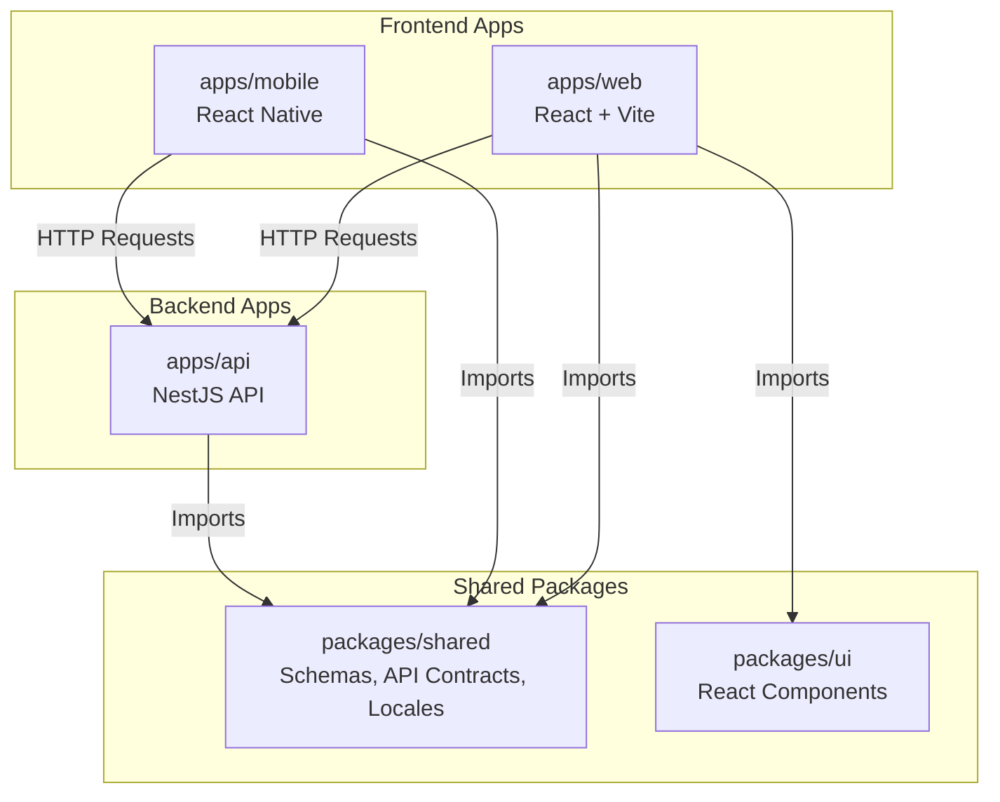
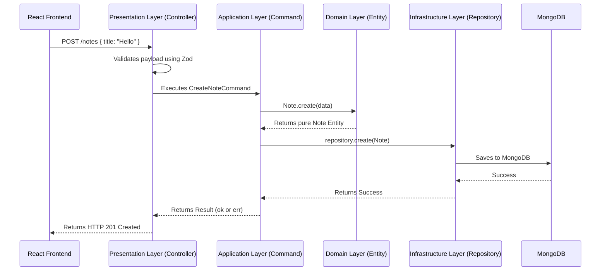

# The Ultimate Guide to Our Architecture

Welcome! If you are new to the project, or if you just want to understand exactly how everything fits together, you are in the right place.

This document explains **everything** in simple English. It uses maps and diagrams so you can visualize the flow of data. By the time you finish reading, you will understand exactly how to build features perfectly.

> [!NOTE]  
> **The Core Philosophy:** We build for the long term. We want a codebase where it is impossible to make mistakes. We achieve this by using strict rules, type-safety, and isolating different parts of the code so they don't tangle together.

---

## The Big Picture (System Map)

Before we look at the code, let's look at the big picture. Our code is organized as a **Monorepo** using a tool called Turborepo. This means all our apps and packages live in one single Git repository.



### Why a Monorepo?

In the past, you might have one repository for the backend and one for the frontend. If the backend developer changes an API, the frontend breaks.
With our Monorepo, the backend and frontend share a special package called `packages/shared`. If the backend changes a rule, the frontend will show a red error instantly before the code is even run!

---

## 1. The Single Source of Truth (`packages/shared`)

### What is it?

This is the most important folder in the project. It holds all the rules for our data.

### What goes inside?

- **Zod Schemas**: Rules for what data should look like (e.g., `Email must be a string`).
- **ts-rest Contracts**: The exact blueprints for our API endpoints (e.g., `POST /users requires this body`).
- **Locales (i18n)**: All the text shown to users (e.g., `en.json` containing `"userNotFound": "User not found"`).

### Why do we need it?

To prevent repeating ourselves. The backend uses the Zod schemas to validate incoming data. The frontend uses the _exact same_ Zod schemas to validate forms before submitting.

---

## 2. The Frontend (`apps/web`)

### What is it?

Our website, built with **React 19**, **Vite**, and **TanStack Router**.

### How does it work?

1. **Routing**: We use TanStack Router for 100% type-safe links.
2. **Components**: We never build buttons from scratch. We import `<Button>` from `packages/ui` (which uses shadcn/ui).
3. **Data Fetching**: We use a generated API client (`@repo/api-client`) powered by TanStack Query. It knows exactly what the backend expects.
4. **Text**: We **never** type raw text like `<p>Hello</p>`. We always use the translation hook: `<p>{t('common.hello')}</p>`.

---

## 3. The Backend (`apps/api`)

Our backend uses **NestJS**. But we don't just throw code into controllers. We use a pattern called **Clean Architecture** combined with **CQRS** (Command Query Responsibility Segregation).

This means we divide our code into strict layers, like an onion.

### The Request Flow Map

Here is exactly how a request travels through the backend when a user tries to create a Note:



Now, let's explain each of those layers in simple English.

---

### Layer A: The Presentation Layer (`presentation/`)

**What it is:** The front door of the backend. It contains Controllers (`notes.controller.ts`).
**The Rule:** Controllers are stupid.
**Why?** Controllers should only care about HTTP (Status codes like 200 or 404, parsing headers, reading the body). They should _never_ make business decisions.
**How to use it:**

- Read the incoming request.
- Pass the data to the Application Layer.
- Get the result back.
- If it succeeded, send a 200 OK. If it failed, send a 400 or 404 with a translated error message using `I18nService`.

### Layer B: The Application Layer (`application/`)

**What it is:** The brain. It contains Commands and Queries.
**The Rule:** Strict CQRS (Command Query Responsibility Segregation).
**Why?** Instead of having one massive `NotesService` file that is 5,000 lines long, we split every single action into its own file.

- Writing data? It goes in a **Command** (e.g., `CreateNoteCommand`).
- Reading data? It goes in a **Query** (e.g., `GetNotesQuery`).
  **How to use it:**
- We **never throw errors** (`throw new Error`). Throwing errors crashes apps.
- Instead, we use a library called `neverthrow`. Every Command returns a `Result`. It either returns `ok(data)` or `err(error)`. The Controller checks which one it is.

### Layer C: The Domain Layer (`domain/`)

**What it is:** The absolute core of the business. It contains Entities (like `Note`).
**The Rule:** No outside tools allowed. No database code, no HTTP code, no framework code. Just pure TypeScript.
**Why?** If you change your database from MongoDB to PostgreSQL tomorrow, your business logic should not change. The Domain Layer ensures your business rules are protected.
**How to use it:**

- Create classes that hold data and rules.
- Example: A `Note` class has a method `updateTitle()`. If the new title is empty, the `Note` class stops it. The rule lives inside the `Note`, nowhere else.

### Layer D: The Infrastructure Layer (`infrastructure/`)

**What it is:** The dirty work. It talks to the database, Redis, and external APIs.
**The Rule:** No business logic allowed.
**Why?** The Application Layer doesn't know _how_ to save a Note to MongoDB. It just asks the Infrastructure Layer to do it.
**How to use it:**

- This is where we write our Mongoose Schemas.
- We create Repositories (like `NotesRepository`) that extend our `BaseRepository`.
- **The Magic Trick:** When the Repository fetches a document from MongoDB, it is an ugly database object. Before giving it back to the Application Layer, the Repository uses a `mapper` to convert it back into a pure, clean Domain Entity.

---

## 4. Handling Errors Gracefully (The `neverthrow` Rule)

In most apps, when something goes wrong, developers write `throw new Error("Something bad happened")`.

> [!WARNING]  
> **We never use `throw` in our Application or Domain layers.**

### Why?

When you throw an error, it acts like a bomb. It blows up the current process and flies up the chain until something catches it. It is very hard to predict.

### Our Solution: Results

Instead of throwing, our functions return a `Result` box. The box either contains a success (`ok`) or a failure (`err`).

```typescript
// Inside the Command
if (noteAlreadyExists) {
  return err(new NoteAlreadyExistsError()); // Safe!
}
return ok(newNote); // Safe!
```

```typescript
// Inside the Controller
const result = await command.execute(data);

if (result.isErr()) {
  // We politely open the box, see it's an error, and tell the user.
  return { statusCode: 400, message: i18n.t("api.note.exists") };
}

// We open the box, see the success data, and send it back.
return result.value;
```

---

## 5. Summary Checklists for Developers

If you are asked to build a new feature (like "Invoices"), use this simple checklist:

- [ ] **Shared:** Did I create the Zod schema and ts-rest contract in `packages/shared`?
- [ ] **Domain:** Did I create an `Invoice` pure TypeScript class in `domain/entities`?
- [ ] **Infrastructure:** Did I create a Mongoose schema and an `InvoicesRepository` in `infrastructure/`?
- [ ] **Application:** Did I create a specific `CreateInvoiceCommand` in `application/commands/` that returns a `Result`?
- [ ] **Presentation:** Did I create an `InvoicesController` that calls the command and maps the result to HTTP?
- [ ] **Text:** Did I put all the English text inside `packages/shared/src/i18n/locales/en.json`?
- [ ] **Frontend:** Did I build the UI using components from `packages/ui` and translate text using `useTranslation()`?

If you checked all those boxes, you have written **perfect, clean, enterprise-grade code**. Welcome to the team!
